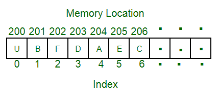
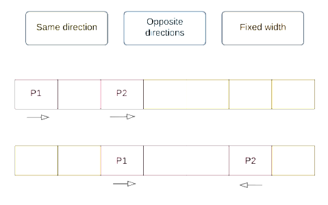

# Array

<!-- TOC -->
* [Array](#array)
  * [Overview](#overview)
  * [Applications](#applications)
  * [Algorithms & Techniques](#algorithms--techniques)
    * [Two-Pointer traversal](#two-pointer-traversal)
<!-- TOC -->

## Overview



An array is a collection of items stored at contiguous memory locations. 
The idea is to store multiple items of the same type together.
This makes it easier to calculate the position of each element by simply adding an offset to a base value
(i.e., the memory location of the first element of the array).

## Applications

1. Store data elements of the same data type.
2. CPU Scheduling.
3. Implement other data structures like Stacks, Queues, Heaps, Hash tables, etc.

## Algorithms & Techniques

### Two-Pointer traversal



> Two pointers help us cover a sub-array within the main array.

The strength of this technique is that we will never have more than $𝑂(𝑛)$ 
iterations for the while loop because the pointers start $𝑛$ away from each other and move at least
one step closer in every iteration. Therefore, if we can keep the work inside each iteration at $𝑂(1)$,
we'll have linear runtime.
 
### Sliding window

#### The algorithm

In sliding window, we maintain two variables `left` and `right`, which at any given time
represent the current subarray under consideration. For expanding the size of the window,
we increase right. For shrinking the window, we increase left.

```
function fn(arr):
    left = 0
    for (int right = 0; right < arr.length; right++):
        Do some logic to "add" element at arr[right] to window

        while WINDOW_IS_INVALID:
            Do some logic to "remove" element at arr[left] from window
            left++

        Do some logic to update the answer
```

When the window must have a fixed size `k`:

```
function fn(arr, k):
    curr = some data to track the window

    // build the first window
    for (int i = 0; i < k; i++)
        Do something with curr or other variables to build first window

    ans = answer variable, probably equal to curr here depending on the problem
    for (int i = k; i < arr.length; i++)
        Add arr[i] to window
        Remove arr[i - k] from window
        Update ans

    return ans
```

#### Problems

There is a very common group of problems involving subarrays that
can be solved efficiently with sliding window.

First, the problem will either explicitly or implicitly define criteria that make a subarray "valid".
There are 2 components regarding what makes a subarray valid:

1. __A constraint metric__: Some attribute of the array such as the number of unique elements, their frequency, etc.
2. __A numeric restriction__ on the constraint metric.

Second, the problem will ask you to find subarrays in some way:

1. The most common task is to find __the best__ valid subarray based on some criteria.
2. Find the number of valid subarrays.

Some examples of common problems are:

- Find the longest subarray with at most K distinct elements.
- Find the longest subarray with the sum less than or equal to `k`.
- Find the longest substring that has at most one `0`.
- Find the number of subarrays that have a product less that `k`.
