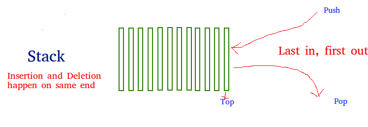

# Stack

* Overview
* Common Procedures

> [Java examples](https://github.com/herrera-ignacio/datastructures-in-java/tree/master/src/main/java/linear/stack)

## Overview


Stack is a linear data structure which follows a LIFO/FILO order for operations.



> In a __stack__, the element deleted from the set is the one most recently inserted.

## Common Procedures

```
STACK-EMPTY(S)
  if S.top == 0
    return TRUE
  else return FALSE

PUSH(S,x)
  S.top = S.top + 1
  S[S.top] = x

POP(S)
  if STACK-EMPTY(S)
    error "underflow"
  else S.top = S.top - 1
    return S[S.top + 1]
```
