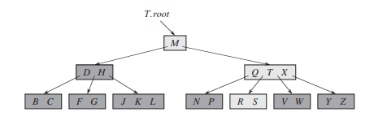
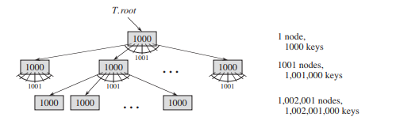
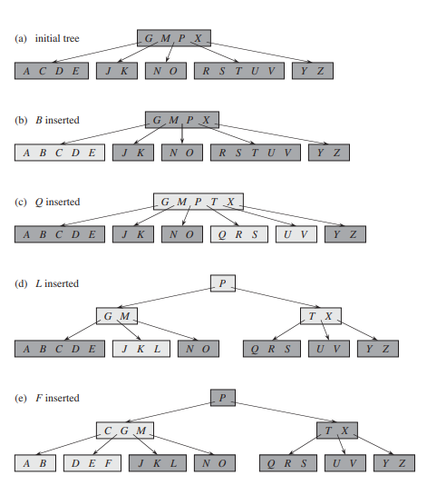
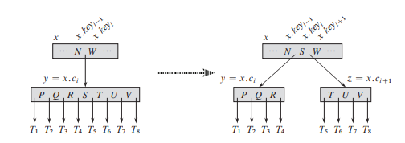
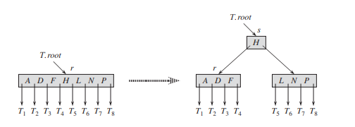
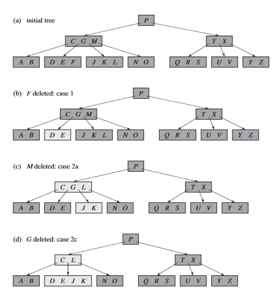
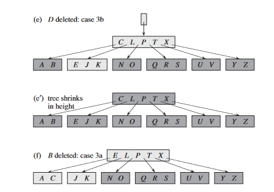

# B-Trees

- [B-Trees](#b-trees)
  - [Overview](#overview)
  - [Definition](#definition)
  - [The height of a B-tree](#the-height-of-a-b-tree)
    - [Theorem](#theorem)
  - [Basic Operations](#basic-operations)
    - [Search $O(log_t n)$](#search-olog_t-n)
    - [Create Empty $O(1)$](#create-empty-o1)
    - [Insert $O(t log_t n)$](#insert-ot-log_t-n)
      - [Splitting a Node $\Theta(t)$](#splitting-a-node-thetat)
    - [Delete a key $O(th) = O(t log_t n)$](#delete-a-key-oth--ot-log_t-n)

## Overview

*B-trees* are **balanced search trees** designed to work well on disks or other direct-access secondary stovage devices. B-trees are similar to *red-black trees*, but they are better at **minimizing disk I/O operations**. Many database systems use B-trees, or variants of it, to store information.


> A B-tree whose keys are the consonants of English. An internal node `x` containing `x.n` keys has `x.n + 1` children. All leaves are at the same depth in the tree. The lightly shaded nodes are examined in a search for the letter R.

* B-trees differ from red-black trees in that B-tree **nodes may have many children**. That is, the *"branching factor"* of a B-tree can be quite large, although it usually depends on characteristics of the disk unit tested.

* B-trees are similar to red-black trees in that **every n-node B-tree has height $O(lg n)$**. Therefore, we can also use B-trees to implement many dynamic-set operations in time $O(lg n)$.

* The keys in node `x` serve as diving points separating the range of keys handled by `x` into `x.n + 1` subranges, each handled by one child of `x`. When searching for a key in a B-tree, we make an `(x.n + 1)`-way decision based on comparisons with the `x.n` keys stored at node `x`.

## Definition



A *B-tree* `T` is a rooted tree (whose root is `T.root`) having the following properties:

1. Every node `x` has the following attributes:
   1. `x.n`, the number of keys currently stored in node `x`.
   2. the `x.n` keys themselves, stored in nondecreasing order, so that $x.key_1 \leq x.key_n \leq ... \leq x.key_{x.n}$
   3. `x.leaf`, a boolean value that is `TRUE` only if `x` is a leaf.

2. Each internal node `x` also contains `x.n + 1` pointers $x.c_1, x.c_2, ..., x.c_{x.n+1}$ to its children.

3. The keys $x.key_i$ separate the ranges of keys stored in eaech subtree: if $k_i$ is any key stored in the subtree with root $x.c_i$ then: $k_1 \leq x.key_1 \leq k_2 \leq x.key_2 \leq ... \leq x.key_{x.n} \leq k_{x.n+1}$

4. All leaves have the same depth, which is the tree's height $h$.

5. Nodes have lower and upper bounds on the number of keys they can contain. We express these bounds in terms of a fixed integer $t \geq 2$ called the **minimum degree** of the B-tree:
   1. Every node other than the root msut have at least $t - 1$ keys. Every internal node other than the root thus has at least $t$ children. If the tree is nonempty, the root must have at least one key.
   2. Every node may contain at most $2t - 1$ keys. Therefore, an internal node may have at most $2t$ children. We say that a node is **full** if it contains exactly $2t - 1$ keys.

The simplest B-tree occurs when $t = 2$. Every internal node has either 2, 3 or 4 children, and we have a **2-3-4 tree**. In practice, however,much larger values of $t$ yield B-trees with smaller height.

## The height of a B-tree

The number of disk accesses required for most operations on a B-tree is proportional to the height of the B-tree.

### Theorem

If $n \geq 1$, then for any n-key B-tree $T$ of height $h$ and minimum degree $t \geq 2$:

$h \leq log_t \frac{n+1}{2}$

## Basic Operations

The procedures are all "one-pass" algorithms that proceed downward from the root of the tree, withoug having to back up.

In these procedures, we adopt **two conventions**:

* The root of the B-tree is always in main memory, so that we never need to perform a *DISK-READ* on the root; we do have to perform a *DISK-WRITE* of the root, however, whenever the root node is changed.

* Any nodes that are passed as parameters must already have had a *DISK-READ* operation performed on them.

### Search $O(log_t n)$

Searching a B-tree is much like searching a BST, except that instead of making a binary, or "two-say", branchind decision at each node, we make a **multiway branching decision** according to the number of the node's children. More precisely, at each internal node $x$, we make an $(x.n + 1)$-way branching decision.

The top-level call is of the form `B-TREE-SEARCH(T.root, k)`. If `k` is in the B-tree, `B-TREE-SEARCH` returns the ordered pair `(y,i)` consisting of a node `y` and an index `i` such that $y.key_i = k$. Otherwise, the procedure returns `NIL`.

```
B-TREE-SEARCH(x, k) {
   i = 1
   // find smallest index such that k <= x.key_i
   while i <= x.n and k > x.key_i
      i = i + 1
   // Check if found
   if i <= x.n and k == x.key_i
      return(x, i)
   // Terminate if leaf
   elseif x.leaf
      return NIL
   // Recurse to search the appropriate subtree
   else DISK-READ(x.c_i)
      return B-TREE-SEARCH(x.c_i, k)
}
```

### Create Empty $O(1)$

> *B-TREE-CREATE* requires $O(1)$ disk operations and $O(1)$ CPU time.

To build a B-tree $T$, we first use *B-TREE-CREATE* to create an empty root node and then call *B-TREE-INSERT* to add new keys. Both of these procedures use an auxiliariy procedure *ALLOCATE-NODE*, which allocates one disk page to be used as a new node in $O(1)$ time. We can assume that a node created by *ALLOCATE-NODE* requires no *DISK-READ*, since there is as yet no useful information stored on the disk for that node.

```
B-TREE-CREATE(T)
   x = ALLOCATE-NODE()
   x.leaf = true
   x.n = 0
   DISK-WRITE(x)
   T.root = x
```

### Insert $O(t log_t n)$

We insert the new key into an existing leaf node. For this, we introduce an operation that **splits** a full node $y$ (having $2t - 1$ keys) around its **median key** $y.key_t$ into nwo nodes having only $t - 1$ keys each. The median key moves up into $y$'s parent to identify the dividing point between the two new trees. But if $y$'s parent is also full, we must split it before we can insert the new key, and thus we could end up splitting full nodes all the way up the tree.



```
B-TREE-INSERT(T, k) {
   r = T.root
   if r.n == 2t - 1
      s = ALLOCATE-NODE()
      T.root = s
      s.leaf = FALSE
      s.n = 0
      s.c_1 = r
      B-TREE-SPLIT-CHILD(s, 1)
      B-TREE-INSERT-NONFULL(s, k)
   else
      B-TREE-INSERT-NONFULL(r, k)
}

B-TREE-INSERT-NONFULL(x, k) {
   i = x.n
   
   if x.leaf
      // If x is leaf, then insert key k into x
      while i >= 1 and k < x.key_i
         x.key_(i+1) = k.key(i)
         i = i - 1
      x.key_(i+1) = k
      DISK-WRITE(x)
   else
      // If x is not a leaf, then we must insert k into the appropriate leaf node
      // in the subtree rotted at internal node x.
      // We determine the child of x to which the recursion descends
      while i >= 1 and k < x.key_i
         i = i - 1
      i = i + 1

      DISK-READ(x.c_i)

      // Determine if recursion would descend to a full child
      if (x.c_i).n == 2t - 1
         // Split full child into two nonfull children
         B-TREE-SPLIT-CHILD(x, i)
         if k > x.key_i
            // Determine which of the two new children is the correct one to descend to
            i = i + 1
      
      // Recurses to insert k into the appropriate subtree
      B-TREE-INSERT-NONFULL(x.c_i, k)
}
```

#### Splitting a Node $\Theta(t)$

The procedure *B-TREE-SPLIT-CHILD* takes as input a *nonfull* internal node $x$, and an index *i* such that $x.c_i$ is a *full* child of $x$. The procedure then splits this child in two and adjusts $x$ so that it has an additional child.

To split a full root, we will first make the root a child of a new empty root node, so that we can use *B-TREE-SPLIT-CHILD*. The tree thus **grows in height by one**; splitting is the **only means by which the tree grows**.



> We split the full node $y = x.c_i$ with $t = 4$ about its median key $S$, which moves up into $y$'s parent node $x$. Those keys in $y$ that are greater than the median key move into a new node $z$, which becomes a new child of $x$.



> Splitting the root with $t = 4$. Root node $r$ splits in two, and a new root node $s$ is created. The new root contains the median key of $r$ and has two halves of $r$ as children. The B-tree grows in height by one when the root is split.

```
B-TREE-SPLIT-CHILD(x, i) {
   z = ALLOCATE-NODE()
   y = x.c_i
   z.leaf = y.leaf

   for j = 1 to t-1
      z.key_j = y.key_(j+t)
   
   if not y.leaf
      for j = 1 to t
         z.c_j = y.c_(j+t)
   y.n = t - 1

   x.c_(i+1) = z
   for j = x.n downto i
      x.key_(j+1) = x.key_j
   x.key_i = y.key_t
   x.n = x.n+1

   DISK-WRITE(y)
   DISK-WRITE(z)
   DISK-WRITE(x)
}
```

### Delete a key $O(th) = O(t log_t n)$

> It involves only $O(h)$ disk operatiosn for a B-tree of height $h$, since only $O(1)$ calls to *DISK-READ* and *DISK-WRITE* are made between recursive invocations of the procedure

When we delete a key from an internal node, we will have to rearrange the node's children. As in insertion, we must guard against deletion producing a tree whose structure violates the B-tree properties. For the case of deletion, we must ensure that a node doesn't get too small during deletion (except that the root is allowed to have fewer than the minimum number t-1 of keys). A simmple approach to deletion might have to back up if a node, along path to where the key to deleted is, has the minimum number of keys.

The procedure *B-TREE-DELETE* deletes the key $k$ from the subtree rooted at $x$. We design this procedure to **guarantee that whenever it calls itself recursively on a node $x$, the number of keys in $x$ is at least the minimum degree $t$**. Note that this condition requires one more key than the minimum required by the usual B-tree conditions, so that sometimes a key may have to be moved into a child node before recursion descends to that child. **This strengthened condition allows us to delete a key from the tree in one downward pass** without having to "Back up" (with one exception).

You should interpret the following specification for deletion from a B-tree with the understanding that if the root node $x$ ever becomes an internal node having no keys (cases 2c and 3b), then we delete $x$, and $x$'s only child $x.c_1$ becomes the new root of the tree, decreasing the height of the tree by one and preserving the property that the root of the tree contains at least one key (unless the tree is empty).

1. If the key $k$ is in node $x$ and $x$ is a leaf, delete the key $k$ from $x$. This

2. If the key $k$ is in node $x$ and $x$ is an internal node, do the following:
   
   a. If the child $y$ that preceds $k$ in node $x$ has at least $t$ keys, then find the predecessor $k'$ of $k$ in the subtree rooted at $y$. Recursively delete $k'$, and replace $k$ by $k'$ in $x$.

   b. If $y$ has fewer than $t$ keys, then, symmetrically, examine the child $z$ that follows $k$ in node $x$. If $z$ has at least $t$ keys, then find the successor $k'$ of $k$ in the subtree rooted at $z$. Recursively delete $k'$, and replace $k$ by $k'$ in $x$.

   c. Otherwise, if both $y$ and $z$ have only $t - 1$ keys, merge $k$ and all of $z$ into $y$, so that $x$ loses both $k$ and the pointer to $z$, and $y$ now contains $2t - 1$ keys. Then free $z$ and recursively delete $k$ from $y$.

3. If the key $k$ is not present in internal node $x$, determine the root $x.c_i$ of the appropriate subtree that must contain $k$, if $k$ is in the tree at all. If $x.c_i$ has only $t - 1$ keys, execute step 3a or 3b as necessary to guarantee that we descend to a node containing at least $t$ keys. Then finish by recursing on the appropriate child of $x$.

   a. If $x.c_i$ has only $t - 1$ keys but has an immediate sibilign with at least $t$ keys, give $x.c_i$ an extra key by moving a key from $x$ down to $x.c_i$, moving a key from $x.c_i$'s immediate left or right sibiling up into $x$, and moving the appropriate child pointer from the sibiling into $x.c_i$.

   b. If $x.c_i$ and both of $x.c_i$'s immediate sibilings have $t - 1$ keys, merge $x.c_i$ with one sibiling, which involves moving a key from $x$ down into the new merged node to become the median key for that node.



> The minimum degree for this B-tree is $t=3$, so a node (other than the root) cannot have fewer than 2 keys. Nodes that are modified are lightly shaded. (b) Deletion of F. This case 1: simple deletion from a leaf. (c) Deletion of M. This is case 2a: the predecessor L of M moves up to take M's position. (d) Deletion of G. This is case 2c: we push G down to make node DEGJK and then delete G from this leaf (case 1).



> (e) Deletion of D. This is case 3b: the recursion cannot descend to node CL because it has only 2 keys, so we push P down and merge it with CL and TX to form CLPTX; then we delete D from a leaf (case 1). (e') After (e), we delete the root and the tree shrinks in height by one. (f) Deletion of B. This is case 3a: C moves to fill B's position and E moves to fill C's position.
