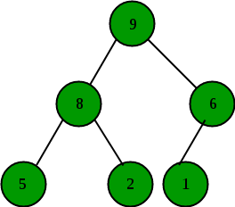
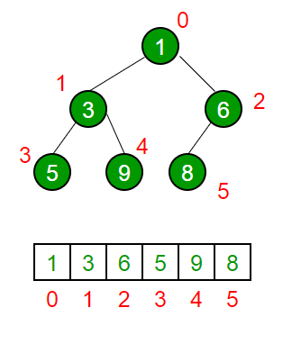

# Binary Heap

* Overview
* Applications
* Height
* Types & Heap Property
  * Max Heap
  * Min Heap
* Procedures
  * Get Relative Index
  * Traveral
  * Maintaining the Heap Property
  * Building a Heap
  * Others

> * [Java examples](https://github.com/herrera-ignacio/datastructures-in-java/tree/master/src/main/java/trees/heaps)  

## Overview

The *Binary Heap* is a *Binary Tree* with the following properties:

* It is a *Complete Tree*. This property makes Heap suitable to be stored in an array.

> In a *Complete Tree*, all levels are completely filled except possibly for the last level and the last level has all keys as left as possible.

* It is either *Min Heap* or *Max Heap*, the same property must be recursively true for all nodes in the tree.

> In a Min Binary Heap, the key at root must be minimumn among all keys present in the Binary Heap. Max Binary Heap is the opposite.

```
            10                      10
         /      \               /       \  
       20        100          15         30  
      /                      /  \        /  \
    30                     40    50    100   40
```

## Applications

* **Heap Sort** uses *Binary Heap* to sort an array in `O(n log n) time`.

* **Priority Queues** can be efficiently implemented using *Binary Heap* because it supports `insert`, `delete`, `extractMax`, `decreaseKey` operations in `O(log n)` time.

* **Graph Algorithms** use *priority queues* in algorithms like **Dijkstra's Shortest Path** and **Prim's Minimum Spanning Tree**.

* Many problems can be efficiently solved using *Heaps*.
  * **K'th Largest Element in an Array**
  * **Sort an almost sorted array**
  * **Merge K Sorted Arrays**

## Height

Viewing a heap as a tree, we define the __height__ of a node in a heap to be the number of edges on the longest simple downward path from the node to a leaf, and we define the height of the heap to be the height of its root.

Since a heap of n elements is based on a complete binary tree, its height is __Theta(n)__.

## Types & Heap Property

There are two kinds of binary heaps, max-heaps & min-heaps. In both kinds, the values in the nodes satisfy a __heap proprety__.

### Max Heap



In a __max-heap property__ is that for every node `i` other than the root:

```
A[PARENT(i)] >= A[i]
```

That is, the value of a node is at most the value of its parent. Thus, the largest element in a max-heap is stored at the root4, and the subtree rooted at a node contains values no larger than that contained as the node itself.

### Min Heap


A min-heap is organized in the opposite way, the __min-heap property__ is that for every node i other than the root:

```
A[PARENT(i)] <= A[i]
```

The smallest element in a min-heap is at the root.

## Procedures

* _MAX-HEAPIFY_ procedure, which runs in O(lg n) time, is the key to maintaining the max-heap property.

* _BUILD-MAX-HEAP_ procedure, which runs in O(n) time, procedues a max-heap from an unordered input array.

* _MAX-HEAP-INSERT_, _HEAP-EXTRACT-MAX_, _HEAP-INCREASE-KEY_, _HEAP-MAXIMUM_ procedures, which run in O(lg n) time, allow the heap data structore to imlement a __priority queue__.

### Get Relative Index

```
PARENT(i): return Floor(i/2)
LEFT(i): return 2i
RIGHT(i): return 2i + 1
```

### Traversal



### Maintaining the heap property

When MAX-HEAPIFY is called, it assumes that the binary trees rooted at LEFT(i) and RIGHT(i) are max heaps, but that A[i] might be smaller than its children, thus violating the max-heap property. MAX-HEAPIFY lets the value at `A[i]` "float-down" in the max-heap so that the subtree rooted at index i obeys the max-heap property.

```
MAX-HEAPIFY(A, i):
  l = LEFT(i)
  r = RIGHT(i)
  if l <= A.heap-size and A[l] > A[i]
    largest = l
  else larget = i
  if r <= A.heap-size and A[r] > A[largest]
    largest = r
  if largest != i
    exchange A[i] with A[largest]
      MAX-HEAPIFY(A, largest)
```

This takes __O(lg n)__ time.

### Building a heap

We can use the MAX-HAPIFY procedure in a bottom-up manner to convert an array A[1..n], into a max-heap.

The elements in the subarray A[(n/2 + 1)..n] are all leaves of the tree, and so each is a 1-element heap to begin with. The procedure BUILD-MAX-HEAP goes through the remaining nodes of the tree and runs MAX-HEAPIFY on each one.

```
BUILD-MAX-HEAP(A):
  A.heap-size = A.length
  for i = [A.length/2] downto 1
    MAX-HEAPIFY(A, i)
``` 

Each call to MAX-HEAPIFY costs O(lg n) time, and BUILD-MAX-HEAP makes O(n) such calls, thus the running time is O(n lg n). This upper bound, though correct, is not asymptotically tight.

We can prove the __running time of BUILD-MAX-HEAP is O(n)__.

### Other Procedures

```
HEAP-MAXIMUM(A)
  return A[1]

HEAP-EXTRACT-MAX(A) // O(lg n)
  if A.heap-size < 1
    error "heap underflow"
  max = A[1]
  A[1] = A[A.heap-size]
  A.heap-size = A.heap-size - 1
  MAX-HEAPIFY(A, 1)
  return max

HEAP-INCREASE-KEY(A, i, key) // O(lg n)
  if key < A[i]
    error "new key is smaller than current key"
  A[i] = key
  while i > 1 and A[PARENT(i)] < A[i]
    exchange A[i] with A[PARENT(i)]
    i = PARENT(i)

MAX-HEAP-INSERT(A, key) // (lg n)
  A.heap-size = A.heap-size + 1
  A[A.heap-size] = -infinity
  HEAP-INCREASE-KEY(A, A.heap-size, key)
```
