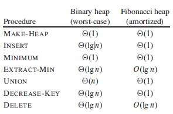
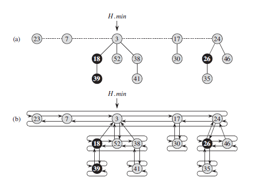

# Fibonacci Heaps

- [Fibonacci Heaps](#fibonacci-heaps)
  - [Definition](#definition)
  - [Operations](#operations)
  - [Structure](#structure)
  - [Theoretical standpoint](#theoretical-standpoint)
  - [Practical standpoint](#practical-standpoint)

## Definition

The Fibonacci heap data structure serves a dual purpose:

1. It supports a set of operations that constitutes what is known as a [mergeable heap](../mergeable-heap).
2. Several of its operations run in *constant amortized time*, which makes this data structure well suited for applications that invoke these operations frequently.

## Operations

In addition to the [mergeable heap](../mergeable-heap) five operations, Fibonacci Heaps also support the following two operations:

* $DECREASE-KEY(H, x, k)$: Assigns to element *x* within heap *H* the new key value *k*, which we assume to be no greater than its current key value.

* $DELETE(H, x)$: Deletes element *x* from heap *H*.

> We are considering mergeable *min* heaps. Alternatively, we could define a mergeable *max* heap with the operations *MAXIMUM*, *EXTRACT-MAX*, and *INCREASE-KEY*.

## Structure

A Fibonacci heap is a *collection of rooted trees* that are *min-heap ordered*. That is, each tree obeys the min-heap property

## Theoretical standpoint

Fibonacci heaps are specially desirable when the number of *EXTRACT-MIN* and *DELETE* operations is small relative to the number of operations performed.

Fast algorithms for problems such as computing minimum spanning trees and finding single-source shortest paths make essential use of Fibonacci heaps.

## Practical standpoint

Constant factors and programming complexity of Fibonacci heaps make them less desirable than ordinary *binary/k-ary heaps* for most applications, except for certain applications that manage *large amounts of data*. Thus, they are predominantly of *theoretical interest*.
