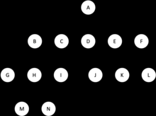
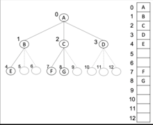
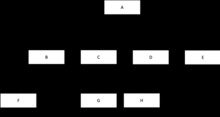

# M-ary tree

* Overview
* Unbounded Branching
* Types
* Design & Implementation
  * Arrays
  * Pointer-based
  * Unbounded branching

## Overview

In *graph theory*, an *M-ary tree* (also known as *K-ary* or *K-way* tree) is a rooted tree 
in which each node has no more than $m$ children.

> An example of a m-ary tree with `m=5`.

## Types

* **Full**: Each node has either 0 or $m$ children.

* **Complete**: Every level, *except possible the last* is completely filled, and all nodes in the last level are as far left as possible. It is maximally space efficient.

* **Perfect**: Full m-ary tree in which all *leaf nodes* are at the same depth.

## Common usages

- File systems.
- Database indexing (particularly B-trees, a type of M-ary tree).
- Routing tables.
- Prefix trees (also known as Tries).
- Symbol tables.
- Compression algorithms.

## Design & Implementation

### Arrays

Stored in *breadth-first* order as an implicit data structure in arrays, and if the tree is a *complete tree*, this method wastes no space.

### Pointer-based

Each node would have an internal array for storing pointers to each of its $m$ children.

### Unbounded branching

We can represent any class of trees in which the number of children of each node is at most some constant k. We replace `left` and `right` attributes by `child_1, ..., child_k`.

**This scheme no longer works when the number of children of a node is unbounded**, since we do not know how many attributes to allocate in advance. Moreover, even if the number of children $k$ is **bounded by a large constant**, but most nodes have a small number of children, we may waste a lot of memory.

Fortunately, there is a **clever scheme to represent trees with arbitrary numbers of children**, using only $O(n)$ space for any n-node rooted tree.

Each node contains a parent pointer `p`, and `T.root` points to the root of tree $T$. Instead of having a pointer to each children, however, each node $x$ has only two pointers:

1. `x.left-child` points to the leftmost child of node x
2. `x.right-sibiling` points to the sibling of x immediately to its right.
