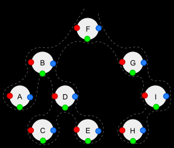

# Depth-first Search

- [Depth-first Search](#depth-first-search)
  - [Overview](#overview)
  - [Time complexity](#time-complexity)
  - [Use cases](#use-cases)
  - [Base Algorithm](#base-algorithm)
    - [Apply to Arbitrary Trees](#apply-to-arbitrary-trees)
  - [Orders (types)](#orders-types)
    - [Pre-order: NLR (red)](#pre-order-nlr-red)
    - [Post-order: LRN (blue)](#post-order-lrn-blue)
    - [In-order: LNR (green)](#in-order-lnr-green)
    - [Reverse pre-order: NRL](#reverse-pre-order-nrl)
    - [Reverse post-order: RLN](#reverse-post-order-rln)
    - [Reverse in-order, RNL](#reverse-in-order-rnl)

## Overview

In _DFS_ the search tree is deepened as much as possible before going to the next sibiling.

> Depth-first search is easily implemented via a stack, including recursively (via the call stack).

## Time complexity

Depth-first search visits every vertex once and checks every edge in the graph once. Therefore, DFS complexity is $O(|V| + |E|)$.

It is mos space-efficient than _breadth-first search_ because BFS keeps a priority queue of the entire frontier while DFS maintains a few pointers at each level.

## Use cases

Depth-first search is used in:

- Topological sorting.
- Scheduling problems.
- Cycle detection in graphs (e.g., spanning trees, mapping routes).
- Solving puzzles with only one solution (e.g., maze, sudoku).

## Base Algorithm

Perform the following operations at each node:

1. If the current node is empty then return.
2. Execute the following three operations in a certain order:
   1. (N) Visit the current node.
   2. (L) Recursively traverse the current node's left subtree.
   3. (R) Recursively traverse the current node's right subtree.

### Apply to Arbitrary Trees

To traverse arbitrary trees (not necessarily binary trees) with depth-first search, perform the following operations at each node:

1. If the current node is empty then return.
2. Visit the current node for _pre-order traversal_.
3. For each i from 1 to the current node's number of subtrees - 1, or from the latter to the former for _reversal traversal_, do:
   1. Recursively traverse the current node's i-th subtree.
   2. Visit the current node for _in-order traversal_.
4. Recursively traverse the current node's last subtree.
5. Visit the current node for _post-order traversal_.

## Orders (types)

There are three common ways to traverse them in _depth-first order_: **in-order, pre-order and post-order**. Beyond these basic traversals, various more complex or hybrid schemes are possible, such as depth-limited searches like iterative deepening depth-first search.

Depth-first traversal (dotted path) of a binary tree:

- Pre-order (node visited at position red): F, B, A, D, C, E, G, I, H
- In-order (node visited at position green): A, B, C, D, E, F, G, H, I
- Post-order (node visited at position blue): A, C, E, D, B, H, I, G, F

### Pre-order: NLR (red)

1. Visit current node
2. Recursively traverse left subtree
3. Recursively traverse right subtree

The pre-order traversal is a _topologically sorted one_, because a parent node is processed before any of its child nodes is done.

### Post-order: LRN (blue)

1. Recursively traverse left subtree
2. Recursively traverse right subtree
3. Visit the current node

### In-order: LNR (green)

1. Recursively traverse left subtree
2. Visit the current node
3. Recursively traverse right subtree

### Reverse pre-order: NRL

1. Visit current node
2. Recursively traverse right subtree
3. Recursively traverse left subtree

### Reverse post-order: RLN

1. Recursively traverse right subtree
2. Recursively traverse left subtree
3. Visit the current node

### Reverse in-order, RNL

1. Recursively traverse right subtree
2. Visit the current node
3. Recursively traverse left subtree

> In a _binary search tree_ ordered such that in each node the key is greater than all keys in its left subtree and less than all keys in its right subtree, _reverse in-order_ traversal retrieves the keys in _descending sorted order_.
