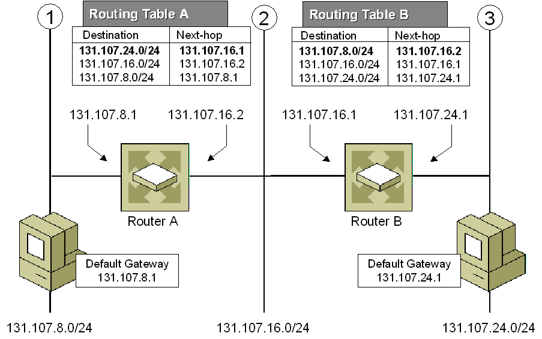

# Trie (Prefix tree)

> https://leetcode.com/problems/implement-trie-prefix-tree/solutions/127843/implement-trie-prefix-tree/

## Overview

Trie (pronunced "try") or _prefix tree_ is a data structure used for __retrieval of a key in a dataset of strings__.

* [JavaScript Trie demo](trie.js)

## Use cases

### Autocomplete

> Google [autocomplete](https://en.wikipedia.org/wiki/Autocomplete) suggest in action.

### Spell checker

// [Spell checker](https://en.wikipedia.org/wiki/Spell_checker) used in word processor.

### IP routing (longest prefix matching)

> [Longest prefix matching algorithm](https://en.wikipedia.org/wiki/Longest_prefix_match) uses _Tries in Internet Protocol (IP)_ routing to select an entry from a forwarding table.

### T9 predictive text

> T9, which stands for [Text on 9 keys](https://en.wikipedia.org/wiki/T9_(predictive_text)), was used on phones to input texts during the late 1990s.

### Solving word games

> Tries is used to solve word games like [Boggle](https://en.wikipedia.org/wiki/Boggle) efficiently by pruning the search space.

## Comparison with Hash Map

There are data structures, like _balanced trees_ and _hash tables_, which give us the possibility to search for a word in a dataset of strings. Although hash table has $O(1)$ time complexity for looking for a key, it is not efficient in the following operations:

* Finding all keys with a common prefix.
* Enumerating a dataset of strings in lexicographical order.

Moreover, hash tables increase in size, there are lots of hash collisions and the search time complexity could deteriorate to $O(n)$, where $n$ is the number of keys inserted. __Trie could use less space when storing many keys with the same prefix__.

In this case, using a trie has only $O(m)$ time complexity, where $m$ is the key length. 

## Trie node structure

Trie is a _rooted tree_ and its nodes have the following fields:

* Maximum of $R$ links to its children, where each link corresponds to one of $R$ character values from a dataset alphabet (e.g., 26 letters of the lowercase English alphabet).
* Boolean field which specifies whether the node corresponds to the end of the key, or is just a key prefix.

> Repsentation of a key "leet" in trie.

## Insertion

We insert a key by searching into the trie. We start from the root and search a link corresponding to the first key character.

* If the link exists, then we move down following the link and continue searching for the next key character.
* Else, we create a new node and link it with the parent node, matching the current key character. Repeat this step until we reach the end of the key and mark it as the end node.

> Insertion of keys into a trie.

### Complexity analysis

> $m$ is the key length.

* Time complexity: $O(m)$

In each iteration, we either examine or create a node in the trie till we reach the end of the key.

* Space complexity: $O(m)$

In the worst case, newly inserted key doesn't share a prefix with the keys already inserted and we have to add $m$ new nodes.

## Search

Each key is represented as a path from the root to an internal node or leaf. We start from the root and examine for a link corresponding to the key character.

1. If the link exists, we move down following the link and continue searching for the next key character.
2. If the link doesn't exist, and we are at the end of the key, and the node is marked as the end, then the key is present in the trie.
3. Else, the key is not present in the trie.

> Search for "leet" in trie.

### Complexity analysis

* Time complexity: $O(m)$.
* Space complexity: $O(1)$.
