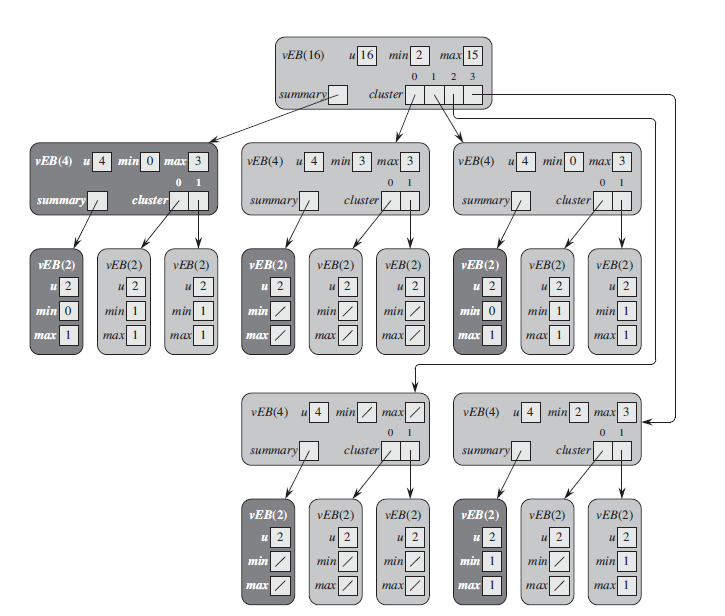

# Van Emde Boas Trees

Van Emde Boas trees support the *priority-queue operations* - *SEARCH*, *INSERT*, *DELETE*, *MINIMUM*, *MAXIMUM*, *SUCCESSOR*, and *PREDECESSOR* - and a few others, each in *O(lg lg n)* time. The hitch is that the keys must be integers in the range 0 to *n-1*, with *no duplicates* allowed.

