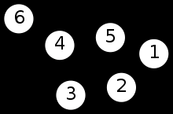
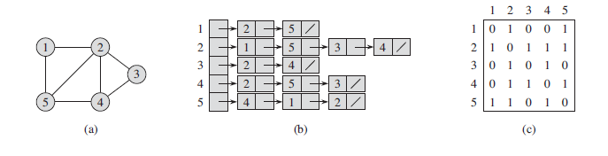
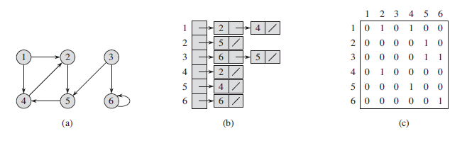

# Graph

- [Graph](#graph)
  - [Overview](#overview)
  - [Directed and Undirected Graphs](#directed-and-undirected-graphs)
  - [Representation](#representation)
  - [Adjacency-list representation](#adjacency-list-representation)

## Overview

In mathematics, and more specifically in [graph theory](https://en.wikipedia.org/wiki/Graph_theory), a graph is a structure amounting to a _set of objects_ in which some pair of the objects are in some sense "related".

The object correspond to mathematical abstractions called _vertices_ (also _nodes_ or _points_), and each of the related pairs of vertices is called an _edge_ (also _link_ or _line_)

## Directed and Undirected Graphs

**The edges may be directed or undirected**. For example, if the vertices represent people at a party, and there is an edge between two people if they shake hands, then this graph is undirected because any person A can shake hands with a person B _only if_ B also shakes hands with A.

In contrast, if any edge from a person A to a person B corresponds to A owes money to B, then this graph is directed, because owing money is **not necessarily reciprocated**.

The former type of graph is called an _undirected graph_ while the latter type of graph is called a _directed graph_. 

## Representation

There are two standard ways to represent a graph *G = (V, E)*, either directed or unidirected:

1. Collection of adjancency lists
2. Adjancency matrix 

Because *adjacency-list* representation provides a compact way to represent **sparse** graphs - those for which $|E|$ is much less than $|V|^2$ - it is usually the method of choice.

We may prefer an *adjacency-matrix* representation when the graph is **dense** - $|E|$ is close to $|V|^2$ - or when we need to be able to tell quickly if there is an edge connecting two given vertices.

> (a) An undirected graph G with 5 vertices and 7 edges. (b) An adjacency-list representation of G. (c) The adjacency-matrix representation of G.

> (a) A directed graph G with 6 vertices and 8 edges. (b) An adjacency-list representation of G. (c) The adjacency-matrix representation of G.

## Adjacency-list representation

The adjacency-list representation of a graph *G = (V, E)* consists of an array *Adj* of *|V|* lists, one for each vertex in *V*. For each $u \in V$, the adjacency list *Adj[u]* contains all the vertices *v* such that there is an edge $(u,v) \in E$. That is, *Adj[u]* consists of all the vertices adjacent to *u* in *G*.
