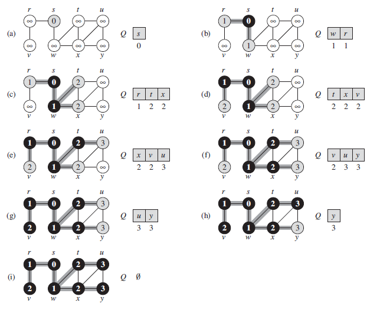

# Breadth-first Search

- [Breadth-first Search](#breadth-first-search)
  - [Overview](#overview)
  - [Use cases](#use-cases)
  - [Implementation](#implementation)
    - [Tree: iterative implementation](#tree-iterative-implementation)
    - [Graph: Coloring](#graph-coloring)
  - [Complexity](#complexity)
    - [Analysis](#analysis)
    - [Complexity in trees](#complexity-in-trees)
  - [Examples](#examples)
    - [Maze-solving](#maze-solving)
    - [Chess endgame](#chess-endgame)

## Overview

**Breadth-first search** is one of the simplest algorithms for searching a graph and the archetype for many important graph algorithms.

> Prim's minimum-spanning-tree algorithm and Dijkstra's single-source shortest-paths algorithm use ideas similar to those in BFS.

The search radiates out from the starting point. You'll check first-degree connections before second-degree connections.

Extra memory, usually a queue, is needed to keep track of the child nodes that were encountered but not yet explored.

> Notice that this only works if you search items in the same order which they're added to the list. This is why _queues_ are commmonly used. Otherwise, you might end up checking a second-degree connection before you finished with all first-degree connection.

## Use cases

There are two general problems that BFS can solve:

- Find if there's a path from node A to node B.
- Find the shortest distance between two things.
  - Calculate the fewest moves to victory in checkers.
  - Spell checker (fewest edits from your misspelling).
  - Find the doctor closest to you in your network.

Moreover, BFS can be used to solve many problems in graph theory, for example:

- [Cheney's algorithm (Tracing garbage collection)](https://en.wikipedia.org/wiki/Cheney%27s_algorithm)
- Find the shortest path between two nodes.
- Serialization/deserialization of a binary tree vs serialization in sorted order, allows the tree to be re-constructed in an efficient manner.
- Testing if a graph is bi-partite.
- Parallel algorithms for computing a graph's transitive closure.

## Implementation

### Tree: iterative implementation

```pseudo
procedure BFS(T, root)
    let Q be queue
    label root as visited
    Q.enqueue(root)

    while Q is not empty
        v = Q.dequeue()

        // Some logic with v here

        if v is the end
          return v

        for all edges from v to w in T.adjacentEdges(v) do
            // For a binary tree, those are the left and right children
            if edge is not visited
                label edge as visited
                Q.enqueue(edge)
```

BFS starts at the tree root and explores all nodes at the present depth prior to moving on to the nodes at the next depth level.

> The search tree is **broadened as much as possible** before going to the next depth.


> Level order: F, B, G, A, D, I, C, E, H.

1. It uses a _queue_ (FIFO).
2. It checks whether a vertex has been explored before enqueing it.

If $G$ is a tree, replacing the queue with a stack will yield a DFS algorithm.

### Graph: Coloring

The fllowing BFS implementation assumes that the input graph $G = (V, E)$ is represented using _adjacency lists_.

```pseudo
BFS(G, s):

for each vertex u in G.V - { s }
  u.color = WHITE
  u.distance = +infinity
  u.predecesor = NIL
s.color = GRAY
s.distance = 0
s.predecessor = NIL
Q = empty_set

ENQUEUE(Q, s)

while (Q != empty_set)
  u = DEQUEUE(Q)
  for each v in G.Adj[u]
    if v.color == WHITE
      v.color = GRAY
      v.distance = u.d + 1
      v.predecessor = u
      ENQUEUE(Q, v)
  u.color = BLACK
```

> `u.distance` holds the distance from the source `s` to vertex `u` computed by the algorithm.



## Complexity

- Time complexity: The time complexity can be expressed as $O(|V| + |E|)$, since every vertex $V$ and every edge $E$ will be explored in the worst case.

- Space complexity: When additional data structures are used to determine which vertices have already been added to the queue, the space complexity can be expressed as $O(|V|)$.

> Note that $O(|E|)$ may vary between $O(1)$ and $O(|V|^2)$, depending on how sparse the input graph is.

### Analysis

We use _aggregate analysis_.

- Enqueuing and dequeuing take _O(1)_ time, and so the total time devoted to queue operations is _O(V)_.
- The procedure scans the adjacency list of each vertex only when the vertex is dequeued, it scans each adjacency list at most once. Since the sum of the lengths of all adjacency lists is $\Theta(E)$, the total time spent in scanning adjacency lists is _O(E)_.

Thus, the running time of BFS procedure is _O(V + E)_. Thus, BFS runs in time _linear_ in the size of the adjacency-list representation of G.

### Complexity in trees

> Refer to this [SO post](https://stackoverflow.com/questions/64657483/time-complexity-of-bfs-and-dfs-on-a-binarytree-why-on).

In case the graph is a tree, then the number of edges is $|V| - 1$. Therefore, the time complexity is $O(|V|)$ because $O(|V| + |E|) = O(|V| + |V| - 1)$.

## Examples

### Maze-solving

It is used in the [Maze-solving algorithm](https://en.wikipedia.org/wiki/Maze-solving_algorithm).


### Chess endgame

In a [chess endgame](https://en.wikipedia.org/wiki/Chess_endgame), a chess engine may build the game tree from the current position by applying all possible moves, and use BFS to find a win position for white.

In contrast, (plain) DFS explores the node branch as far as possible before backtracking and expanding other nodes, may get lost in an infinite branch and never make it to the solution node.

> On the other hand, DFS algorithms get along without extra memory.
