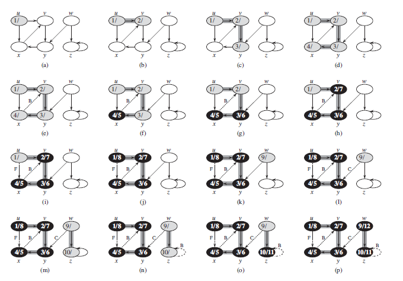
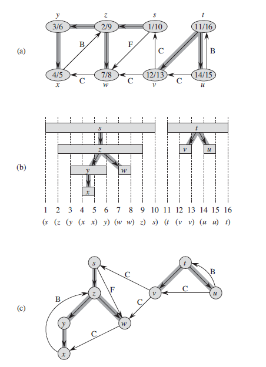

# Depth-first Search

## Definition

The strategy followed by DFS is, as its name implies, to search *deeper* in the graph whenever possible. DFS explores edges out of the most recently discovered vertex *v* that still has unexplored edges leaving it.

Once all of *v*'s edges have been explored, the search *backtracks* to explore edges leaving the vertex from which *v* was discovered. This process continues until we have discovered all the vertices that are reachable from the original source vertex. If any undiscovered vertices remain, then DFS selects one of them as a new source, and it repeats the search from that source. The algorithm repeats this entire process until it has discovered every vertex.

## Example Implementation

```
DFS(G)
for each vertex u in G.V
  u.color = WHITE
  u.predecesor = NIL
time = 0
for each vertex u in G.V
  if u.color == WHITE
    DFS-VISIT(G, u)

################

DFS-VISIT(G, u)
time = time + 1 // white vertex u has just been discovered
u.distance = time
u.color = GRAY
for each v in G.Adj[u] // explore edge(u, v)
  if v.color == WHITE
    v.predecesor = u
    DFS-VISIT(G, v)
u.color = BLACK
time = time + 1
u.f = time // timestamp for when the search finishes examining v's adjacency list (and blackens v)
```



## Properties



a. The result of a DFS of a *directed graph*. Vertices and Timestamps are indicated in the image.

b. Intervals for the discovery time and finishing time of each vertex correspond to the parenthesization. Each rectangle spans the interval given by the discovery and finishing times of the corresponding vertex.

c. The graph of part (a) redrawn with all tree and forward edges going down within a depth-first tree and all black edges going up from a descendant to an ancestor.
