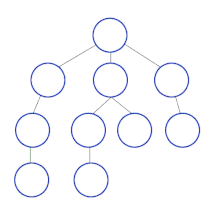
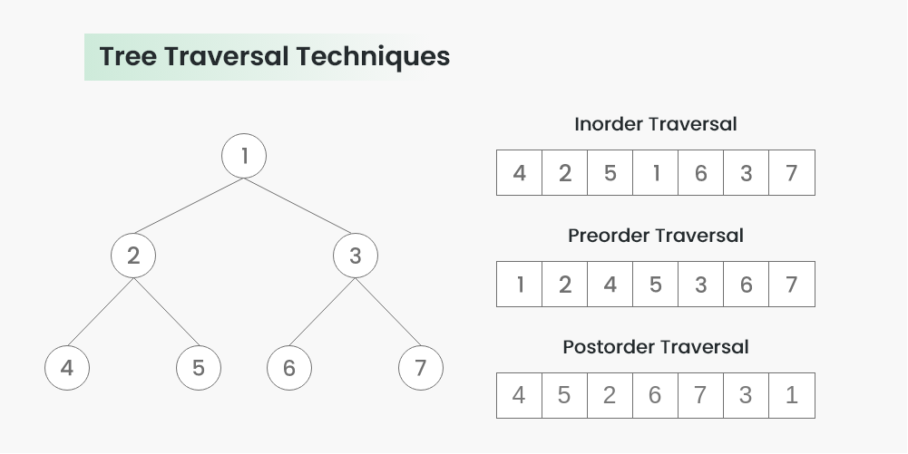

# Depth-first Search

- [Depth-first Search](#depth-first-search)
  - [Overview](#overview)
  - [Pseudocode](#pseudocode)
    - [Recursive](#recursive)
    - [Iterative](#iterative)
  - [Time \& space complexity](#time--space-complexity)
  - [Non-termination](#non-termination)
  - [Vertex ordering - Graph traversal](#vertex-ordering---graph-traversal)

## Overview

DFS traverses or searches tree or graph data structures. It starts at the root node (selecting some arbitrary node in the case of a graph) and explores as far as possible along each branch before backtracking.

> Extra memory, usually a stack, is needed to keep track of the nodes discovered so far along a specified branch which helps in backtracking.



## Pseudocode

### Recursive

```text
DFS(G, v) is
  label v as discovered
  for all directed edges from v to w that are in G.adjacentEdges(v) do
    if vertex w is not label as discovered then
      DFS(G, w)
```

### Iterative

```text
DFS_iterative(G, v) is
  let S be a stack
  S.push(v)
  while S is not empty do
    v = S.pop()
    if v is not labeled as discovered then
      label v as discovered
      for all edges from v to w in G.adjacentEdges(v) do
        s.push(w)
```

## Time & space complexity

When traversing an entire graph, it takes time $O(|V| + |E|)$, where $|V|$ is the number of vertices and $|E|$ the number of edges. It also uses space $O(|V|)$ in the worst case to store the stack of vertices on the current search pat as well as the set of already-visited vertices.

Thus, time and space bounds are __the same as for BFS__ and the choice of which of these to use depends on the different properties of the vertex ordering the two produce.

## Non-termination

In specific domains, such as searching for solutions in AI or web-crawling, the graph to be traversed is often either too large to visit in its entirety or infinite. In such cases, search is only performed to a __limited depth__. Also, due to limited resources, one typically does not use data structures to keep track of the set of all previously visited vertices.

When an appropriate depth limit is not known a priori, __iterative deepening depth-first search__ applies DFS repeatedly with a sequence of increasing limits.

## Vertex ordering - Graph traversal

DFS can be used to linearly order the vertices of a graph or tree.



- __preordering__: in the order that they were _first_ visited by DFS.
- __postordering__: in the order that they were _last_ visited by DFS.
- __inorder__: traverse the left subtree, then the root, and then the right subtree.
- __reverse preordering__: in the opposite order of their first visit.
- __reverse postordering__: in the opposite order of their last visit.
