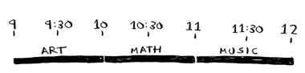

# Classroom scheduling

- [Classroom scheduling](#classroom-scheduling)
  - [Problem](#problem)
  - [Greedy algorithm](#greedy-algorithm)
    - [Example](#example)

## Problem

Suppose you have a classroom and want to hold as many classes here as possible. You get a list of classes.

You can't hold all of these classes because some of them overlap.

## Greedy algorithm

1. Pick the class that ends the soonest. This is the first class you'll hold in this classroom.
2. Pick a class that starts after the first class and finish the soonest.
3. Repeat.

> Greedy algorithms pick the locally optimal solution at each step, and in the end you're left with the globally optimal solution.

### Example

