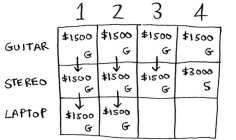

# Knapsack Problem

## Overview

A thief robbing a store finds $n$ items, the $i_{th}$ item is worth $v_i$ dollars and weights $w_i$ pounds (both integers). The thief wants to take as valuable a load as possible, but he can carry at most $W$ pounds in his knapsack. Which items should he take?

- __0-1 variant__: Thief has to make a binary (0-1) choice for each item.
- __Fractional__ variant: Thief can take fractions of items.

## 0-1 variant example

You have a knapsack that can carry 4 lbs of goods. You have three available items and want to steal the maximum money's worth of goods:

- Stereo: $3000, 4 lbs.
- Laptop: $2000, 3 lbs.
- Guitar: $1500, 1 lbs.

### Simple solution

The simplest solution is to try every possible set of goods and find the set that gives you the most value. This works but it's really slow: $O(2^n)$.

### Dynamic programming

Dynamic programming starts by solving sub-problems and builds up to solving the big problem. See [dynamic-programming](../../glossary/dynamic-programming/README.md).

#### Walkthrough

Start solving the problem for smaller knapsacks (or _sub-knapsacks_) and then work up to solving the original problem.

You are going to fill in each cell of the grid. Start with the first row (the guitar row). At each cell there's a simple decision: _do you steal the guitar or not?_.

For now, the guitar fits in all cells and it's the only item you can choose from, therefore, you decide to steal it on every sub-problem.

> Each cell represents the current best guess for this sub-problem.

According to this row, if you had a knapsack of capacity 4 lbs and you can only steal a guitar, the max value would be $1500.

Continuing with the next row (the stereo row). Now you need to decide _do you steal the guitar and/or the stereo?_.

In the first cell, you have a knapsack of 1 lb. The stereo doesn't fit in there, so $1500 remains the max guess for a 1 lb knapsack. Same thing for the 2nd and 3rd cell.

In the case of the 4 lbs knapsack the stereo fits and it's the best choice. The max value would be $3000.

Let's do the same with the last row (the laptop row). It weights 3 lbs, so it won't fit into a 1 lb or a 2 lbs knapsack. The estimate for the first two cells remains the same.

At 3 lbs, you can choose the laptop instead and it's worth more than the previous estimate, so that's our new estimate.

At 4 lbs the current estimate is $3000. You can put the laptop but it's only worth $2000. That's not better than the old estimate but it only weights 3 lbs, si you have 1 lb free!

And you already know the maximum value you can fit into 1 lb of space, it's in the first row and its first column!

Then we have our answer: the best choice is to take the guitar and laptop for a total of $3500.

You combined the solutions to two subproblems to solve the bigger problem:

#### What happens if you add an item?

> You don't have to recalculate everything!

Suppose you can also steal an iPhone worth $2000 and weighted 1 lb.

Add a row for the iPhone:

For the first cell, the iPhone fits into the 1 lb knapsack and we find a bigger value.

In the next cell, you can fit the iPhone _and_ the guitar.

For cell 3, you can't do better than taking the iPhone and the guitar again, so leave it as it is.

For the last cell though, the current max is $3500. You can steal the iPhone instead, and you have 3 lbs of space left over.

These best value for 3 lbs is $2000, known from the old subproblem. This is $4000 which is a new max.

You may ask, __would the value of a column ever go down?__. The answer is __no__. At every iteration, you're storing the current max estimate, it can never get worse than it was before!

> Note, if you add a smaller item that requires finer granularity (e.g., a necklace that weights 0.5 lbs)) you need to change the grid.

#### What happens if you change the order of the rows?

The answer doesn't change.

#### Generalization

Each cell's value gets calculated with the same formula:

## Similar problems

### Optimizing travel itinerary

Suppose you're going to London for a vacation and you have two days there, so you make a list of things you could do.

Instead of a knapsack, you have a __limited amount of time__. Just fill the grid!

## Handling problems that depend on each other

You can't. Dynamic programming _only_ works when each sub-problem is _discrete_: it doesn't depend on other sub-problems.
