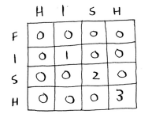
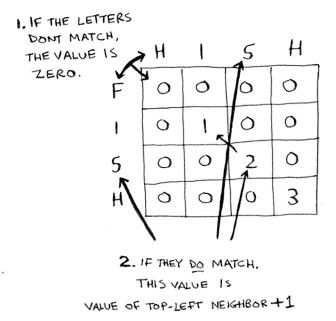
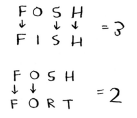
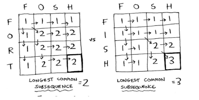
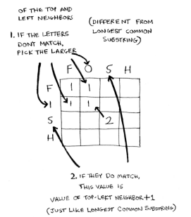

# Longest common substring

## Problem

Find the largest substring that two strings have in common.

## Solution

We'll use dynamic programming. First, build a grid:

- What are the values of the cells? The length of the longest substring.
- How do you divide this problem into sub-problems? Compare substrings.
- What are the axes of the grid? The two words.

### Walkthrough

Consider the strings "fish" and "hish":

You can cheat a little because you already know what the solution should be (_ish_) and then try to find the formula to keep filling the grid.



Here's the formula for filling in each cell:



```python
if word_a[i] == word_b[j]:
    cell[i][j] = cell[i-1][j-1] + 1
else:
  cell[i][j] = 0
```

It contrast with the knapsack problem, he solution is the largest number in the grid, and it may not be the last cell.

### Longest common subsequence example

What if you want to know if "fosh" is closer to "fish" or "fort". The longest substring length is the same: two letters. Nevertheless, "fosh" is closer to "fish".



In this case you need to calculate the [longest common subsequence](../lcs/).

Here's the final grid:



Here's the formula for filling in each cell:



```python
if word_a[i] == word_b[j]:
    cell[i][j] = cell[i-1][j-1] + 1
else:
  cell[i][j] = max(cell[i-1][j], cell[i][j-1])
```
