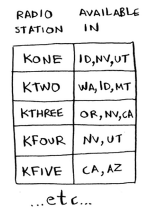
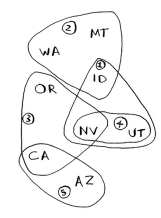
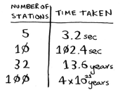
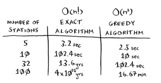

# Set-covering problem

- [Set-covering problem](#set-covering-problem)
  - [Problem](#problem)
  - [$O(2^n)$ Solution](#o2n-solution)
  - [Approximation algorithms](#approximation-algorithms)

## Problem

Suppose you're starting a radio show in the US. You want to reach listeners in all 50 states. You have to decide what stations to play on to reach all those listeners. It costs money to be on each station, so you're trying to minimize the number of stations you play on.

Each station covers a region, and there's overlap.

How do you figure out the smallest set of stations you can play on to cover all 50 states?

## $O(2^n)$ Solution

Getting the most optimal solution takes a long time: $O(2^n)$ where n is the number of stations. It's feasible to do if you have a small set of 5~10 stations.

1. List every possible subset of stations (_power set_). There are $2^n$ possible subsets.
2. From these, pick the set with the smaller number of stations that covers all 50 states.

## Approximation algorithms

Here's a greedy algorithm that comes pretty close and runs in $O(n^2)$ where n is the number of stations.

1. Pick the station that covers the most states that haven't been covered yet. It's okay if it covers some states that have been covered already.
2. Repeat until all the states are covered.

